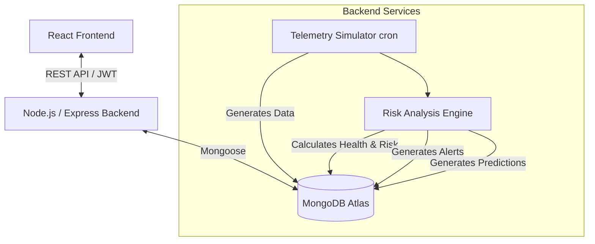
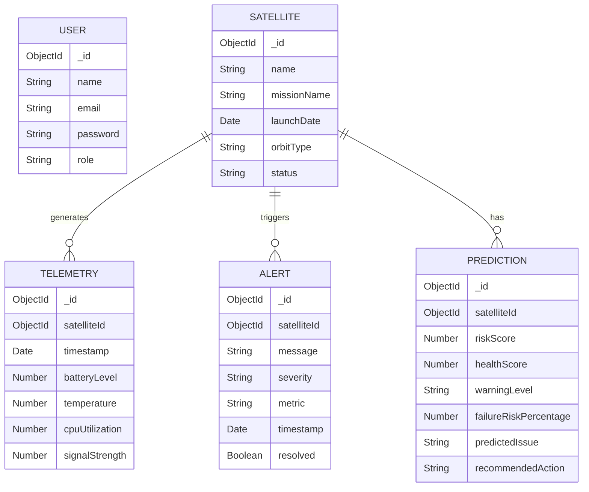

# Architecture & Documentation

## Architecture Diagram

The system follows a classic Client-Server full-stack architecture with a telemetry simulation loop.

## Database Schema (ER Diagram)

## API Documentation

### Auth API (`/api/auth`)
- `POST /signup` - Register a new operator.
- `POST /login` - Authenticate and receive JWT.
- `GET /me` - Get current user profile (Protected).

### Satellite API (`/api/satellites`)
- `GET /` - Retrieve all satellites.
- `POST /` - Register a new satellite.
- `PUT /:id` - Update satellite details.
- `DELETE /:id` - Remove a satellite.

### Telemetry API (`/api/telemetry`)
- `GET /:satelliteId` - Retrieve latest telemetry stream for a specific satellite.

### Alert API (`/api/alerts`)
- `GET /` - Retrieve all generated alerts.
- `PUT /:id/resolve` - Acknowledge and resolve an alert.

### Prediction API (`/api/predictions`)
- `GET /` - Retrieve all risk predictions.
- `GET /:satelliteId` - Retrieve predictions for a specific satellite.

### Analytics API (`/api/analytics`)
- `GET /dashboard` - Retrieve aggregated data for the Mission Control dashboard (KPIs).
